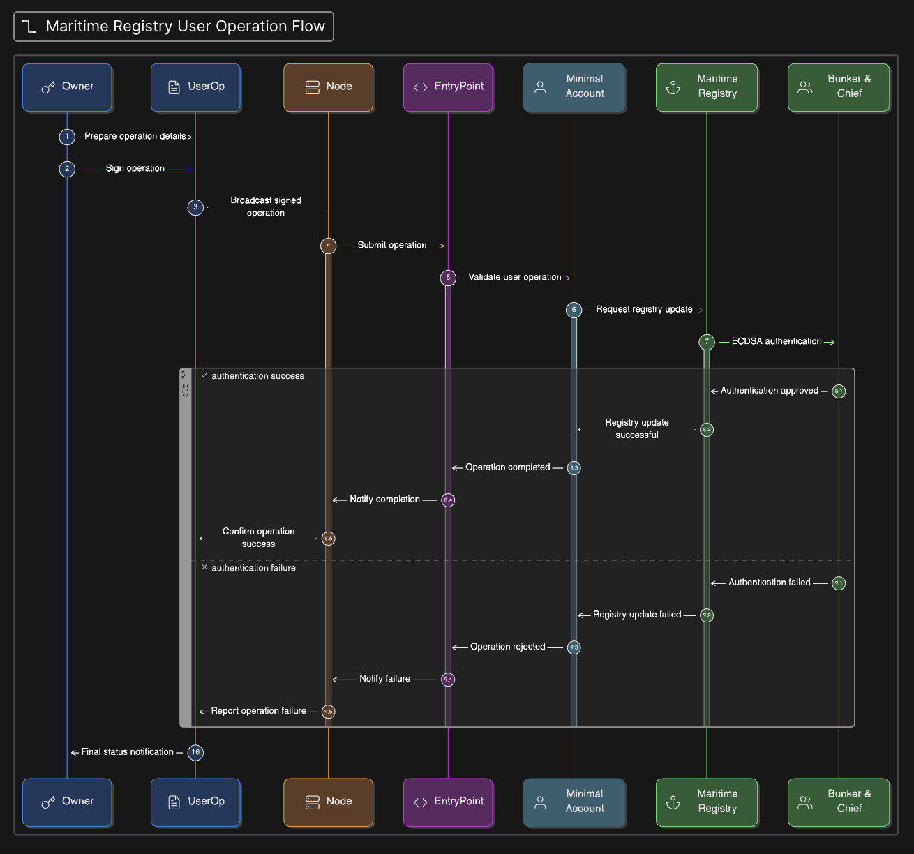

# Project Updates: BunkerChain Evolution (2026)

### Latest Release Notes

The BunkerChain architecture introduces Full Lifecycle Account Abstraction, where every administrative action on the maritime registry is decoupled from traditional private keys.

**Novel Functionality: Secure Ownership Migration**
We have implemented a secure, non-custodial ownership transfer mechanism. The Admin of the Maritime Registry can now rotate the registry's owner or the AA wallet's owner in a secure manner without ever revealing a private key, entirely through signed **UserOperation** transactions. This ensures that even if a signing device is compromised, the protocol can be recovered through its programmable layer.

### The Execution Flow



The end-to-end transaction lifecycle for BunkerChain follows this path:

1. **Authorization**: The **Owner** of the AA contract signs a `UserOperation` transaction.
2. **Propagation**: A **random node** (Bundler) in the Alt-Mempool picks up this signed object and sends it to the blockchain.
3. **Validation Phase**: The **EntryPoint** contract receives the bundle and calls the `MinimalAccount` (the AA wallet).
4. **Signature Check**: The `MinimalAccount` verifies the signature against its current owner using the `UserOperation` object.
5. **Execution Phase**: The `MinimalAccount` executes the internal call data provided in the `UserOperation`.
6. **Registry Action**: The `execute` function calls the **Maritime Registry** contract to perform actions like `nominateBunker` or `finalizeBunker`.
7. **Maritime Verification**: The Registry verifies the dual signatures of both the **Bunker Tanker** and the **Chief Engineer** on-chain using **ECDSA**, ensuring the physical delivery data matches the digital record.

### Comprehensive Test Suite

We have included a full battery of tests covering:

* **Signature Recovery**: Validating on-chain ECDSA recovery for maritime roles.
* **AA Integration**: Testing the EntryPoint's ability to drive Registry state.
* **Administrative Security**: Verifying the secure ownership transfer logic.
* **Workflow Integrity**: End-to-end tests from Nomination to Quantum Sealing.

---

# BunkerChain: Maritime Registry with Account Abstraction

BunkerChain is a blockchain-based registry designed for the maritime bunkering industry. It utilizes **Account Abstraction (AA)** to replace traditional EOA-based management with programmable, gasless, and more secure smart contract wallets.

## Architecture Evolution

This project evolved through three distinct security iterations:

1. **Single AA Role:** Initial testing with the Bunker Tanker (Supplier) as a Smart Contract Wallet.
2. **Dual AA Roles:** Expanding AA functionality to both the Chief Engineer (Ship) and the Supplier (Barge).
3. **AA Management Layer:** The final and most secure architecture where a **MinimalAccount (AA)** acts as the **Owner** of the Maritime Registry.

## Security Model

The ownership chain is established as follows:
**EOA Owner (Signer)** ➔ **MinimalAccount (AA)** ➔ **MaritimeRegistryAAOwner (Logic)**

By introducing this layer, we achieve:

* **Gasless Transactions:** Users can interact via UserOperations without holding ETH.
* **Granular Verification:** Customizable signature verification through the AA wallet.
* **Administrative Integrity:** Core functions like `nominateBunker` are protected by the AA's validation logic.

## Getting Started

### Prerequisites

* [Foundry](https://book.getfoundry.sh/getting-started/installation)

### Installation

```bash
forge install Cyfrin/foundry-devops --no-commit
forge install eth-infinitism/account-abstraction --no-commit

```

### Testing

To run the full end-to-end AA flow:

```bash
forge test -vvv

```

## 4. Documentation of Steps Taken

### Step 1: Initial AA Integration

We started by replacing the static `address` of the Supplier with a `MinimalAccount`. We tested if the Registry could recognize a Smart Contract Wallet as a valid caller for nominations.

### Step 2: Expanding to Dual AA Roles

We realized that in a global maritime ecosystem, both the Ship (Chief Engineer) and the Barge (Supplier) should have their own AA contracts. We updated the `finalizeBunker` function to verify signatures against the `owner()` of these AA contracts rather than just the address itself.

### Step 3: Access Control Refinement

During development, we noted that most maritime operations require administrative oversight. We updated the `nominateBunker` function with an `onlyOwner` modifier to ensure that only an authorized entity can initiate a new delivery record.

### Step 4: Final AA-Owner Architecture

To maximize decentralization and flexibility, we made the **MinimalAccount (AA) the actual Owner of the Maritime Registry**. This allows for:

* **Protocol Sovereignty**: The registry is controlled by code (the AA), not just a single private key, allowing for future upgrades like Multi-sig or Social Recovery.

---

## Final Architecture Documentation

### Key Advantages

* **Gasless UX:** By utilizing the `EntryPoint`, the Barge or Chief Engineer can perform operations without holding native gas, as a Paymaster can be introduced to cover fees.
* **Signature Verification:** Signatures are verified against the **Owner** of the AA contract, allowing for flexible security.
* **Programmable Admin:** The Registry's administrative functions support logic like multi-sig approvals or time-locked actions.

---